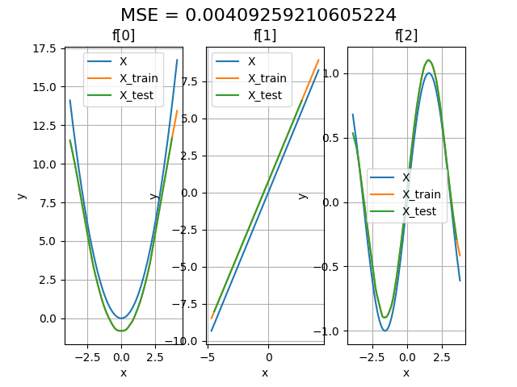

# Neural GAM: Neural Generalized Additive Models

  **[Overview](#overview)**
| **[NeuralGAM Visualization](#neuralgam-visualization)**
| **[Usage](#usage)**


NeuralGAM is a project for Generalized Additive Models (GAM) research. We provide a library which implements Neural GAMs: a way of fitting a Generalized Additive Model by learning a linear combination of Deep Neural Networks. GAMs are a class of non-parametric regression models, where each input feature is a smooth function. 


Each neural network attends to a single input feature. The NeuralGAM is fitted using the backfitting and local scoring algorithms, where a Deep Neural Network is fitted one epoch at a time to learn a smooth function representing the smottthed fit for the residuals of all the others variables. 

## Overview

```python
from src.NeuralGAM.ngam import NeuralGAM
from src.utils.utils import generate_data, plot_multiple_partial_dependencies
```

### Synthetic datasets

We provide a set of datasets to test NeuralGAM for linear/logistic regression problems (folder datasets)

| Type     | Description                                    | Values |
| -----------   | ---------------------------------------------- | ------------------------- |
| GAM type      | Linear Regression (gaussian) or Logistic Regression (binomial) | {gaussian, binomial}                   |
| type          | homogeneity of variance on the intercept term  | {homoscedastic, heteroscedastic}       |
| distibution   | distribution of the X                          | {normal, uniform} 

The simulation generates three different features, each modeling a different function. 

### Parameters

The main script accepts the following parameters:

| Parameter | Shortcut |  Description | Default Value |
| ------------------  | --- | ---------------------------------------------- | ------------------------- |
| --input | -i | input folder with X_train, y_train, X_test, y_test files | ./dataset/homoscedastic_uniform_gaussian |
| --output | -o | output folder to store results and plots | ./results |
| --units | -u | number of hidden units per hidden layer on the main DNN. You can provide a list of values to set multiple hidden layers (i.e. 1024,512,256) | 1024 |
| --family | -f | type of GAM {gaussian, binomial}. Use gaussian for Linear Regression and binomial for Logistic Regression | gaussian |
| --bf_threshold | -c | Convergence Threshold of the backfitting algorithm | 10e-5 |
| --ls_threshold | -d | Convergence Threshold of the Local Scoring algorithm | 0.01 |
| --maxiter_ls| -ls | Maximum iterations to run the Local Scoring algorithm if it does not converge before | 10 |
| --maxiter_bf | -bf | Maximum iterations to run the Backfitting algorithm if it does not converge before | 10 | 

#### Running NeuralGAM

```bash
python main.py -i ./dataset/heteroscedastic_uniform_gaussian -o ./results/heteroscedastic_uniform_gaussian -u 1024 -f gaussian -c 0.00001 -d 0.01 -ls 1 -bf 1
python main.py -i ./dataset/uniform_binomial -o ./results/uniform_binomial -u 1024 -f binomial -c 0.00001 -d 0.01 -ls 1 -bf 1  
```

## Fitting and visualizing NeuralGAM

```python
ngam = NeuralGAM(num_inputs = len(X_train.columns), family=variables["family"], num_units=units)
muhat, fs_train = ngam.fit(X_train = X_train, 
                                y_train = y_train, 
                                max_iter = variables["ls"], 
                                bf_threshold=variables["bf_threshold"],
                                ls_threshold=variables["ls_threshold"],
                                max_iter_backfitting=variables["bf"])
learned_y = ngam.y
err = mean_squared_error(y_train, learned_y)
```

After fitting, the NeuralGAM model returns the learned response function and partial dependence plots after training.  

```python
fs_pred = ngam.get_partial_dependencies(X_test)
plot_partial_dependencies(x=X_test, fs=fs_pred, title="Test Partial Dependence Plot", output_path=output_path + "/pdp_test.png")
plot_partial_dependencies(x=X_train, fs=fs_train, title="Training Partial Dependence Plot", output_path=output_path + "/pdp_train.png")
```

The following image shows the resultant theoretical model from the homoscedastic_uniform_gaussian dataset (in blue), the learned functions for each feature after the training process (orange), and the predicted functions from the test set (green), for a linear regression simulation with heteroscedastic intercept and normally distributed data. 


## Usage

```bash
$ python main.py -h
usage: main.py [-h] [-i INPUT] [-o OUTPUT] [-u UNITS] [-f Distribution Family. Use gaussian for LINEAR REGRESSION and binomial for LOGISTIC REGRESSION]
               [-c Convergence Threshold of backfitting algorithm. Defaults to 10e-5] [-d Convergence Threshold of LS algorithm. Defaults to 0.1]
               [-ls Max iterations of LS algorithm. Defaults to 10.] [-bf Max iterations of Backfitting algorithm. Defaults to 10]
```
