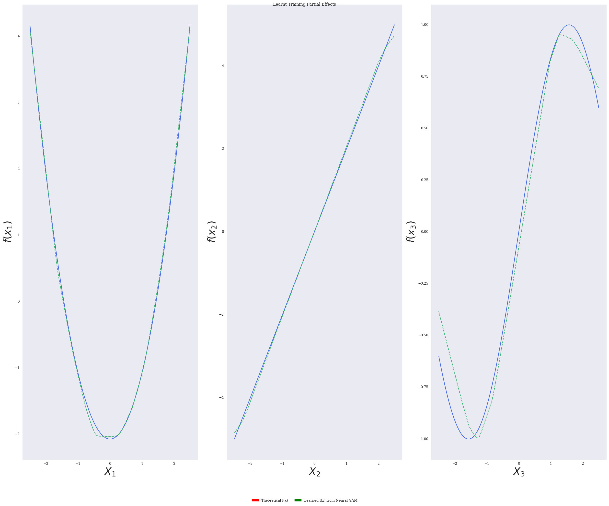

# neuralGAM: Interpretable Neural Network Based on Generalized Additive Models

## Table of contents

1. [Parameters](#parameters)
    1. [neuralGAM](#neuralGAM)
    2. [Sample script](#sample-script)
2. [Running neuralGAM](#running-neuralGAM)
    1. [Linear Regression](#linear-regression)
    2. [Logistic Regression](#logistic-regression)
3. [Fitting and visualizing neuralGAM](#fitting-and-visualizing-neuralGAM)
4. [Sample Usage](#usage)

Neural Networks are one of the most popular methods nowadays given their high performance on diverse tasks, such as computer vision, anomaly detection, computer-aided disease detection and diagnosis or natural language processing. However, it is usually unclear how neural networks make decisions, and current methods that try to provide interpretability to neural networks are not robust enough. 

We introduce **neuralGAM**, a neural network based on **Generalized Additive Models**, which trains a different neural network to estimate the contribution of each feature to the response variable. The networks are trained independently leveraging the local scoring and backfitting algorithms to ensure that the Generalized Additive Model converges and it is additive. The resultant model is a highly accurate and interpretable deep learning model, which can be used for high-risk AI practices where decision-making should be based on accountable and interpretable algorithms. The validity of the proposed algorithm is evaluated through different simulation studies with synthetic datasets, performing well and similarly to another Generalized Additive Model implementation based on Neural Networks but providing higher interpretability. In addition, we evaluate the applicability of neuralGAM for Distributed Denial of Service cyberattack detection on a dataset captured on an Industrial Control System.

This software is also available as an [R package at the CRAN](https://cran.r-project.org/web/packages/neuralGAM/index.html) and in the following [Github Repository](https://github.com/inesortega/neuralGAM/).  

### Citation

If you use neuralGAM in your research, please cite the following paper:

> Ortega-Fernandez, I., Sestelo, M. & Villanueva, N.M. _Explainable generalized additive neural networks with independent neural network training_. Statistics & Computing 34, 6 (2024). https://doi.org/10.1007/s11222-023-10320-5

```
@article{ortega2024explainable,
author = {Ortega-Fernandez, Ines and Sestelo, Marta and Villanueva, Nora M},
doi = {10.1007/s11222-023-10320-5},
issn = {1573-1375},
journal = {Statistics and Computing},
number = {1},
pages = {6},
title = {{Explainable generalized additive neural networks with independent neural network training}},
url = {https://doi.org/10.1007/s11222-023-10320-5},
volume = {34},
year = {2023}
}
```       

### Parameters

#### neuralGAM
To create a neuralGAM object, the following parameters are required: 

| Parameter | Description | Default Value |
| ------------------  | --- | ---------------------------------------------- |
| num_inputs | number of features, representing the number of sub-networks that neuralGAM will train. | n/a |
| family | type of GAM {gaussian, binomial}. Use gaussian for Linear Regression and binomial for Logistic Regression | gaussian |
| num_units | number of hidden units per hidden layer on the Neural Network. You can provide a list of values to set multiple hidden layers (i.e. [1024,512,256]) | n/a |
| learning_rate | Learning rate for the Stochastic Gradient Descent Algorithm | 0.001 |

#### Sample script

The main.py script is provided to show a sample execution of neuralGAM, and accepts the following parameters:

| Parameter | Shortcut |  Description | Example Value |
| ------------------  | --- | ---------------------------------------------- | ------------------------- |
| --input | -i | input folder with X_train, y_train, X_test, y_test files | ./dataset/Scenario_I/homoscedastic_uniform_gaussian |
| --output | -o | output folder to store results and plots | ./results |
| --units | -u | number of hidden units per hidden layer on the main DNN. You can provide a list of values to set multiple hidden layers (i.e. [1024,512,256]) | 1024 |
| --family | -f | type of GAM {gaussian, binomial}. Use gaussian for Linear Regression and binomial for Logistic Regression | gaussian |
| --lr | -l | Learning Rate |  0.001 |
| --bf_threshold | -c | Convergence Threshold of the backfitting algorithm | 10e-5 |
| --ls_threshold | -d | Convergence Threshold of the Local Scoring algorithm | 0.01 |
| --maxiter_ls| -ls | Maximum iterations to run the Local Scoring algorithm if it does not converge before | 10 |
| --maxiter_bf | -bf | Maximum iterations to run the Backfitting algorithm if it does not converge before | 10 | 

#### Running neuralGAM

##### Linear Regression: 
```bash
python main.py -f gaussian -i ./dataset/Scenario_I/heteroscedastic_uniform_gaussian -o ./results/heteroscedastic_uniform_gaussian -u 1024 -c 0.00001 -d 0.01 --maxiter_ls 1 --maxiter_bf 10
```

##### Logistic Regression: 
```bash
python main.py -f binomial -i ./dataset//Scenario_I/uniform_binomial -o ./results/uniform_binomial -u 1024 -c 0.00001 -d 0.01 -ls 1 -bf 1
```

## Fitting and visualizing neuralGAM

Example of fittinga and visualizing a neuralGAM for logistic regression (gaussian family)
```python
ngam = neuralGAM(num_inputs = len(X_train.columns), family="gaussian", num_units=units, learning_rate=learning_rate)

muhat, fs_train_estimated, eta = ngam.fit(X_train = X_train, 
                                y_train = y_train, 
                                max_iter_ls = 10, 
                                bf_threshold=10e-5,
                                ls_threshold=0.01,
                                max_iter_backfitting=10)

learned_y = ngam.y
err = mean_squared_error(y_train, muhat)
```

After fitting, the neuralGAM model returns the learned response function and partial dependence plots learnt during training.  

```python
plot_partial_dependencies(x=X_train, fs=fs_train_estimated, title="Training Partial Dependence Plot", output_path=output_path + "/pdp_train.png")
```

The following image shows the resultant theoretical model from the homoscedastic_uniform_gaussian dataset (in blue), the learned functions for each feature after the training process (orange), and the predicted functions from the test set (green), for a linear regression simulation with heteroscedastic intercept and normally distributed data. 



## Usage

```bash
$ python main.py -h
usage: main.py [-h] [-i INPUT] [-o OUTPUT] [-u UNITS] [-f Distribution Family. Use gaussian for LINEAR REGRESSION and binomial for LOGISTIC REGRESSION]
               [-c Convergence Threshold of backfitting algorithm. Defaults to 10e-5] [-d Convergence Threshold of LS algorithm. Defaults to 0.1]
               [-ls Max iterations of LS algorithm. Defaults to 10.] [-bf Max iterations of Backfitting algorithm. Defaults to 10]
```

### Synthetic datasets

We provide a set of simulation scenarios to test neuralGAM for linear/logistic regression problems (Dataset folder). We used a sample size of $n = 30625$ for all the datasets, which was split into 80\% for training the model and 20\% for testing.

#### Scenario I

For the first scenario, we considered the following predictor:

$\eta = \alpha + \sum^3_{j=1} f_j(X_j),$

with


$\alpha = 2$, and covariates $X_j$ drawn from an uniform distribution $U\left[-2.5, 2.5\right]$.

Based on this scenario, three different simulations were carried out considering two different response distributions

- $Y = \eta + \varepsilon$, where $\varepsilon$ is the error distributed in accordance to a $N(0,\sigma(x)$. In this case, we consider an homoscedastic situation with $\sigma(x) = 0.5$ (R1) and  a heteroscedastic one with $\sigma(x) = 0.5 + \mid 0.25 \times \eta \mid$ (R2).
- $Y \sim \text{Bernoulli}(p)$,  with $p = \exp (\eta) / \exp (1 + \eta)$ (R3).

#### Scenario II

Scenario II replicates the simulation scenario from [Arwal *et al.* (2021)](https://arxiv.org/pdf/2004.13912v2.pdf), focusing on $\textit{Task}_0$, where the response $Y$ is given by

$Y = \sum^3_{j=1} f_j(X_j) + \varepsilon ,$

with 


covariates $X_j$ drawn from an uniform distribution $U\left[-1, 1\right]$ and $\varepsilon$ sampled from a Normal distribution $N(0,\frac{5}{6})$.
